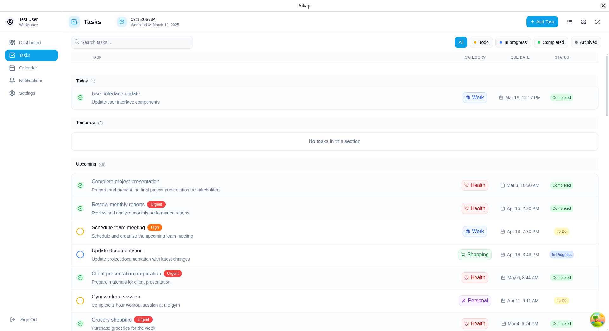
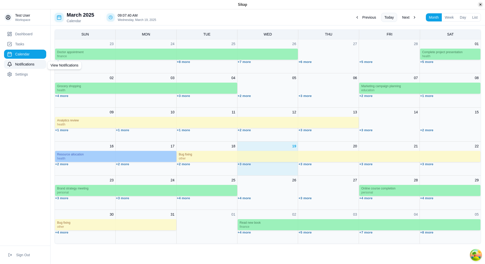

# Sikap - Smart Daily Planner & Task Manager

<div align="center">
  
  <h3>Organize your life with intelligence</h3>
  
  
  
  
</div>

## Overview

Sikap is a powerful cross-platform smart daily planner and task management application designed to streamline your daily productivity. It combines intelligent scheduling with task management capabilities, providing a seamless experience for organizing your day-to-day activities. Built with modern technologies, Sikap helps you stay on top of your schedule and tasks effortlessly.

## Screenshots

<div align="center">
  
  
  <p><i>The Sikap application interface showcasing the daily planner and task management view</i></p>
</div>

> **Note:** To add the screenshot, take a capture of your application's main interface and save it to `resources/screenshots/app-screenshot.png`

## Features

- 🖥️ **Cross-Platform Support** - Works seamlessly on Windows, macOS, and Linux
- 📱 **Responsive Design** - Modern UI that adapts to different screen sizes
- 🌙 **Dark/Light Themes** - Eye-friendly interface for any time of day
- 🔒 **Secure Data Handling** - Your information stays private and protected
- ⭐ **Smart Task Prioritization** - AI-assisted priority management
- 📅 **Flexible Scheduling** - Due dates, reminders, and recurring tasks
- 🗓️ **Calendar Integration** - Intuitive drag-and-drop scheduling
- 🔔 **Intelligent Notifications** - Contextual reminders when you need them
- 📊 **Progress Tracking** - Visual representation of your productivity
- 🔄 **Sync Across Devices** - Always have your latest data wherever you go

## Tech Stack

- **Frontend**:
  - ReactJS - UI Framework
  - TailwindCSS - Styling
  - ElectronJS - Desktop Application Framework

- **Backend**:
  - ExpressJS - API Server
  - Prisma - Database ORM
  - SQLite - Local Database

## Installation

### Prerequisites
- [Node.js](https://nodejs.org/) (v16 or newer)
- [Git](https://git-scm.com/)

### Quick Start
1. Clone the repository:
```bash
git clone https://github.com/generyand/sikap.git
cd sikap
```

2. Install dependencies:
```bash
# Using npm
npm install
```

3. Start the development server:
```bash
npm run dev
```

4. The application will open automatically. If it doesn't, navigate to:
```
http://localhost:3000
```

## Building the Application

### For Windows:
```bash
npm run build:win
```

### For macOS:
```bash
npm run build:mac
```

### For Linux:
```bash
npm run build:linux
```

## Development

### Project Structure
```
sikap/
├── src/
│   ├── main/           # Electron main process
│   ├── preload/        # Preload scripts
│   └── renderer/       # React application
├── resources/          # Application resources
│   └── screenshots/    # Application screenshots
└── build/              # Build configurations
```

### Available Scripts

- `npm run dev` - Start the application in development mode
- `npm run build` - Build the application
- `npm run lint` - Run ESLint
- `npm run format` - Format code with Prettier
- `npm run typecheck` - Run TypeScript type checking

## Contributing

1. Fork the repository
2. Create your feature branch (`git checkout -b feature/amazing-feature`)
3. Commit your changes (`git commit -m 'Add some amazing feature'`)
4. Push to the branch (`git push origin feature/amazing-feature`)
5. Open a Pull Request

## License

This project is licensed under the MIT License - see the [LICENSE](LICENSE) file for details.

## Acknowledgments

- Built with [electron-vite](https://electron-vite.org/)
- Powered by [Electron](https://www.electronjs.org/)
- Icons by [Phosphor Icons](https://phosphoricons.com/)

---

<div align="center">
  <p>Made with ❤️ by Gene Ryan</p>
  <p>
    <a href="https://github.com/generyand">GitHub</a> •
    <a href="https://github.com/generyand/sikap/issues">Report Bug</a> •
    <a href="https://github.com/generyand/sikap/issues">Request Feature</a>
  </p>
</div>
